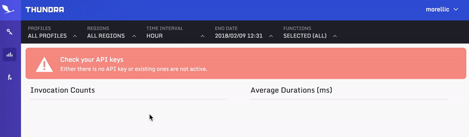

# Hello Thundra Async Example


This is a simple example to trace your lambda go functions with [Thundra](https://www.thundra.io/).

If you haven't done already, start by installing serverless by:
```bash
npm install serverless -g
```

## How to run using serverless

1 - From thundra-examples-lambda-python/hello-thundra-async directory, run:

```bash
pip3 install thundra -t .
```

2 - **Login** to [Thundra](https://www.thundra.io/) to create your API key:



3 - Paste your API key to serverless.yml and also set your AWS S3 deployment bucket:

```
custom:
    deploymentBucket: <your-s3-deployment-bucket>
    thundraApiKey: <your-api-key>
    ...
```

4 - From thundra-examples-lambda-python/hello-thundra-async directory, run:

```bash
sls deploy
```

5 - From thundra-examples-lambda-python/hello-thundra-async directory, run:

```bash
sls invoke --function hello-thundra-async --data '{"message":"Hello Thundra Async!"}'
```

6 - Visit [Thundra](https://www.thundra.io/) to observe your metrics. It might take 1-2 minutes to be visible.


